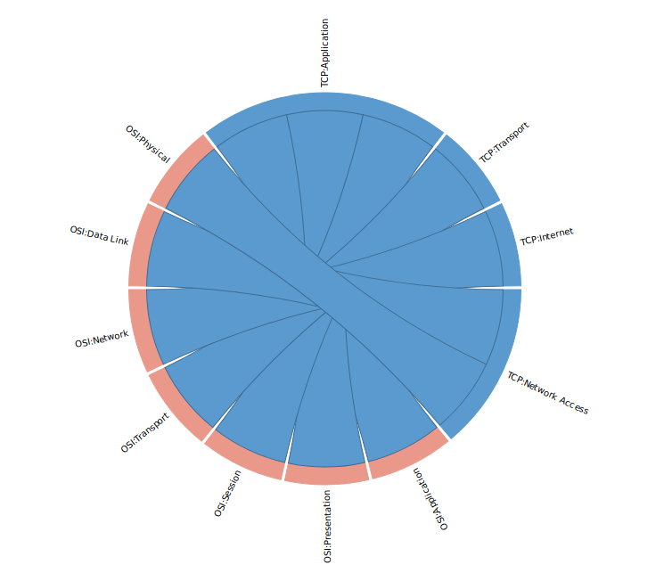

# Mapping Wheel

This is an example of visualisation of *mapping* (i.e. linkage, dependency) with the beatiful [d3js lib](https://d3js.org).

Live example: [OSI to TCP/IP Layers Mapping](https://agryaznov.github.io/mapping-wheel/)

